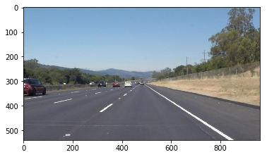
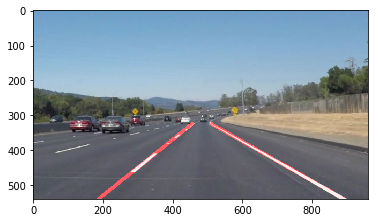

# **Finding Lane Lines on the Road** 
[](http://www.udacity.com/drive)


When we drive, we use our eyes to decide where to go.  The lines on the road that show us where the lanes are act as our constant reference for where to steer the vehicle.  Naturally, one of the first things we would like to do in developing a self-driving car is to automatically detect lane lines using an algorithm.

In this project you will detect lane lines in images using Python and OpenCV.  OpenCV means "Open-Source Computer Vision", which is a package that has many useful tools for analyzing images.  

## If you have already installed the [CarND Term1 Starter Kit](https://github.com/udacity/CarND-Term1-Starter-Kit/blob/master/README.md) you should be good to go!   If not, you can install the starter kit or follow the install instructions below to get started on this project. ##

**Step 1:** Getting setup with Python

To do this project, you will need Python 3 along with the numpy, matplotlib, and OpenCV libraries, as well as Jupyter Notebook installed. 

We recommend downloading and installing the Anaconda Python 3 distribution from Continuum Analytics because it comes prepackaged with many of the Python dependencies you will need for this and future projects, makes it easy to install OpenCV, and includes Jupyter Notebook.  Beyond that, it is one of the most common Python distributions used in data analytics and machine learning, so a great choice if you're getting started in the field.

Choose the appropriate Python 3 Anaconda install package for your operating system <A HREF="https://www.continuum.io/downloads" target="_blank">here</A>.   Download and install the package.

If you already have Anaconda for Python 2 installed, you can create a separate environment for Python 3 and all the appropriate dependencies with the following command:

`>  conda create --name=yourNewEnvironment python=3 anaconda`

`>  source activate yourNewEnvironment`

**Step 2:** Installing OpenCV

Once you have Anaconda installed, first double check you are in your Python 3 environment:

`>python`    
`Python 3.5.2 |Anaconda 4.1.1 (x86_64)| (default, Jul  2 2016, 17:52:12)`  
`[GCC 4.2.1 Compatible Apple LLVM 4.2 (clang-425.0.28)] on darwin`  
`Type "help", "copyright", "credits" or "license" for more information.`  
`>>>`   
(Ctrl-d to exit Python)

run the following commands at the terminal prompt to get OpenCV:

`> pip install pillow`  
`> conda install -c menpo opencv3=3.1.0`

then to test if OpenCV is installed correctly:

`> python`  
`>>> import cv2`  
`>>>`  (i.e. did not get an ImportError)

(Ctrl-d to exit Python)

**Step 3:** Installing moviepy  

We recommend the "moviepy" package for processing video in this project (though you're welcome to use other packages if you prefer).  

To install moviepy run:

`>pip install moviepy`  

and check that the install worked:

`>python`  
`>>>import moviepy`  
`>>>`  (i.e. did not get an ImportError)

(Ctrl-d to exit Python)

**Step 4:** Opening the code in a Jupyter Notebook

You will complete this project in a Jupyter notebook.  If you are unfamiliar with Jupyter Notebooks, check out <A HREF="https://www.packtpub.com/books/content/basics-jupyter-notebook-and-python" target="_blank">Cyrille Rossant's Basics of Jupyter Notebook and Python</A> to get started.

Jupyter is an ipython notebook where you can run blocks of code and see results interactively.  All the code for this project is contained in a Jupyter notebook. To start Jupyter in your browser, run the following command at the terminal prompt (be sure you're in your Python 3 environment!):

`> jupyter notebook`

A browser window will appear showing the contents of the current directory.  Click on the file called "P1.ipynb".  Another browser window will appear displaying the notebook.  Follow the instructions in the notebook to complete the project.  

----------------


# **Finding Lane Lines on the Road Reporting** 
***
In this project, you will use the tools you learned about in the lesson to identify lane lines on the road.  You can develop your pipeline on a series of individual images, and later apply the result to a video stream (really just a series of images). Check out the video clip "raw-lines-example.mp4" (also contained in this repository) to see what the output should look like after using the helper functions below. 

Once you have a result that looks roughly like "raw-lines-example.mp4", you'll need to get creative and try to average and/or extrapolate the line segments you've detected to map out the full extent of the lane lines.  You can see an example of the result you're going for in the video "P1_example.mp4".  Ultimately, you would like to draw just one line for the left side of the lane, and one for the right.

---
Let's have a look at our first image called 'test_images/solidWhiteRight.jpg'.  Run the 2 cells below (hit Shift-Enter or the "play" button above) to display the image.

**Note: If, at any point, you encounter frozen display windows or other confounding issues, you can always start again with a clean slate by going to the "Kernel" menu above and selecting "Restart & Clear Output".**

---

**The tools you have are color selection, region of interest selection, grayscaling, Gaussian smoothing, Canny Edge Detection and Hough Tranform line detection.  You  are also free to explore and try other techniques that were not presented in the lesson.  Your goal is piece together a pipeline to detect the line segments in the image, then average/extrapolate them and draw them onto the image for display (as below).  Once you have a working pipeline, try it out on the video stream below.**

---

<figure>
 
 <figcaption>
 <p></p> 
 <p style="text-align: center;"> Your output should look something like this (above) after detecting line segments using the helper functions below </p> 
 </figcaption>
</figure>
 <p></p> 
<figure>
 
 <figcaption>
 <p></p> 
 <p style="text-align: center;"> Your goal is to connect/average/extrapolate line segments to get output like this</p> 
 </figcaption>
</figure>

**Run the cell below to import some packages.  If you get an `import error` for a package you've already installed, try changing your kernel (select the Kernel menu above --> Change Kernel).  Still have problems?  Try relaunching Jupyter Notebook from the terminal prompt.  Also, see [this forum post](https://carnd-forums.udacity.com/cq/viewquestion.action?spaceKey=CAR&id=29496372&questionTitle=finding-lanes---import-cv2-fails-even-though-python-in-the-terminal-window-has-no-problem-with-import-cv2) for more troubleshooting tips.**  


```python
#importing some useful packages
import matplotlib.pyplot as plt
import matplotlib.image as mpimg
import numpy as np
import cv2
%matplotlib inline
```


```python
#reading in an image
image = mpimg.imread('test_images/solidWhiteRight.jpg')
#printing out some stats and plotting
print('This image is:', type(image), 'with dimesions:', image.shape)
plt.imshow(image)  # if you wanted to show a single color channel image called 'gray', for example, call as plt.imshow(gray, cmap='gray')
```

    This image is: <class 'numpy.ndarray'> with dimesions: (540, 960, 3)
    


    <matplotlib.image.AxesImage at 0x1cab817f9e8>





**Some OpenCV functions (beyond those introduced in the lesson) that might be useful for this project are:**

`cv2.inRange()` for color selection  
`cv2.fillPoly()` for regions selection  
`cv2.line()` to draw lines on an image given endpoints  
`cv2.addWeighted()` to coadd / overlay two images
`cv2.cvtColor()` to grayscale or change color
`cv2.imwrite()` to output images to file  
`cv2.bitwise_and()` to apply a mask to an image

**Check out the OpenCV documentation to learn about these and discover even more awesome functionality!**

Below are some helper functions to help get you started. They should look familiar from the lesson!


```python
import math

def grayscale(img):
    """Applies the Grayscale transform
    This will return an image with only one color channel
    but NOTE: to see the returned image as grayscale
    (assuming your grayscaled image is called 'gray')
    you should call plt.imshow(gray, cmap='gray')"""
    return cv2.cvtColor(img, cv2.COLOR_RGB2GRAY)
    # Or use BGR2GRAY if you read an image with cv2.imread()
    #return cv2.cvtColor(img, cv2.COLOR_BGR2GRAY)
    
def canny(img, low_threshold, high_threshold):
    """Applies the Canny transform"""
    return cv2.Canny(img, low_threshold, high_threshold)

def gaussian_blur(img, kernel_size):
    """Applies a Gaussian Noise kernel"""
    return cv2.GaussianBlur(img, (kernel_size, kernel_size), 0)

def region_of_interest(img, vertices):
    """
    Applies an image mask.
    
    Only keeps the region of the image defined by the polygon
    formed from `vertices`. The rest of the image is set to black.
    """
    #defining a blank mask to start with
    mask = np.zeros_like(img)   
    
    #defining a 3 channel or 1 channel color to fill the mask with depending on the input image
    if len(img.shape) > 2:
        channel_count = img.shape[2]  # i.e. 3 or 4 depending on your image
        ignore_mask_color = (255,) * channel_count
    else:
        ignore_mask_color = 255
        
    #filling pixels inside the polygon defined by "vertices" with the fill color    
    cv2.fillPoly(mask, vertices, ignore_mask_color)
    
    #returning the image only where mask pixels are nonzero
    masked_image = cv2.bitwise_and(img, mask)
    return masked_image

def draw_lines(img, lines, color=[255, 0, 0], thickness=2):
    """
    NOTE: this is the function you might want to use as a starting point once you want to 
    average/extrapolate the line segments you detect to map out the full
    extent of the lane (going from the result shown in raw-lines-example.mp4
    to that shown in P1_example.mp4).  
    
    Think about things like separating line segments by their 
    slope ((y2-y1)/(x2-x1)) to decide which segments are part of the left
    line vs. the right line.  Then, you can average the position of each of 
    the lines and extrapolate to the top and bottom of the lane.
    
    This function draws `lines` with `color` and `thickness`.    
    Lines are drawn on the image inplace (mutates the image).
    If you want to make the lines semi-transparent, think about combining
    this function with the weighted_img() function below
    """
    #My adapted code for optional part -- begins here
    
    # I will separe lines between left side and right side, in order to catch left lane line and right lane line.
    # And select only lines with a consisten slope (between +-0.5 and +-2) 
    
    selectLineLeft = []
    selectLineRight = []
    
    for line in lines:
        for x1,y1,x2,y2 in line:
            if x1 != x2:
                slope = ((y2-y1)/(x2-x1))
                length = (x1-x2)**2+(y1-y2)**2
                if (x1 < img.shape[1]/2) & (x2 < img.shape[1]/2): 
                    if (slope < -0.5) & (slope > -2):
                        #cv2.line(img, (x1, y1), (x2, y2), color, thickness)
                        selectLineLeft.append([length,slope,x1,y1,x2,y2])           
                       
                if (x1 > img.shape[1]/2) & (x2 > img.shape[1]/2): 
                    if (slope > 0.5) & (slope < 2):
                        #cv2.line(img, (x1, y1), (x2, y2), color, thickness)
                        selectLineRight.append([length,slope,x1,y1,x2,y2])
    
     # I ll keep only the longest ones 
    selectLineLeft = select_longest_segment(selectLineLeft)
    selectLineRight = select_longest_segment(selectLineRight)

    # Finally, I extend the lines as longest as possible inside the region of interest
    # Then, I average the lines. Weights according to the square of length of initial segment.
    # And draw the left and right averaged lines.
    LeftLane = segments_extend_to_averaged_line(img, selectLineLeft)
    RightLane = segments_extend_to_averaged_line(img, selectLineRight)
    cv2.line(img, LeftLane[0], LeftLane[1], color, 10)
    cv2.line(img, RightLane[0], RightLane[1], color, 10)
    
def select_longest_segment(segments):
    """
    function to select the longest segment and drop the shortest one
    segments input and output are array [[length,slope,x1,y1,x2,y2]]
    """
    # I ll sort according to length of lines 
    segments.sort(reverse=True)
    # I ll keep only the longest ones
    threshold = segments[0][0]/4
    end = len(segments)
    for i in range(len(segments)):
        if segments[i][0] < threshold:
            end = i
            break
    return segments[:end]
    
def segments_extend_to_averaged_line(img, segments):
    """ 
        function to extend segments (array[[length,slope,x1,y1,x2,y2]] to lines,
        then average them with weight according to the length of segment in one line
        
    """
    weights=[]
    for seg in segments:
        (length,slope,x1,y1,x2,y2)=(seg[0],seg[1],seg[2],seg[3],seg[4],seg[5])
        if y1 < y2:
            seg[3] = img.shape[0] * 3/5
            seg[5] = img.shape[0]
        if y2 < y1:
            seg[3] = img.shape[0] 
            seg[5] = img.shape[0] * 3/5
        seg[2] = int((seg[3]-y1)/slope+x1)
        seg[4] = int((seg[5]-y2)/slope+x2)
        weights.append(length)
    
    AveragedLine = np.average(segments,axis=0,weights=weights)
    
    return ((int(AveragedLine[2]), int(AveragedLine[3])), (int(AveragedLine[4]), int(AveragedLine[5])))
    
# End of my code

def hough_lines(img, rho, theta, threshold, min_line_len, max_line_gap):
    """
    `img` should be the output of a Canny transform.
        
    Returns an image with hough lines drawn.
    """
    lines = cv2.HoughLinesP(img, rho, theta, threshold, np.array([]), minLineLength=min_line_len, maxLineGap=max_line_gap)
    line_img = np.zeros((img.shape[0], img.shape[1], 3), dtype=np.uint8)
    draw_lines(line_img, lines)
    return line_img

# Python 3 has support for cool math symbols.

def weighted_img(img, initial_img, α=0.8, β=1., λ=0.):
    """
    `img` is the output of the hough_lines(), An image with lines drawn on it.
    Should be a blank image (all black) with lines drawn on it.
    
    `initial_img` should be the image before any processing.
    
    The result image is computed as follows:
    
    initial_img * α + img * β + λ
    NOTE: initial_img and img must be the same shape!
    """
    return cv2.addWeighted(initial_img, α, img, β, λ)
```

## Test on Images

Now you should build your pipeline to work on the images in the directory "test_images"  
**You should make sure your pipeline works well on these images before you try the videos.**


```python
import os
os.listdir("test_images/")
```


    ['.ipynb_checkpoints',
     'ComputedsolidWhiteCurve.jpg',
     'ComputedsolidWhiteRight.jpg',
     'ComputedsolidYellowCurve.jpg',
     'ComputedsolidYellowCurve2.jpg',
     'ComputedsolidYellowLeft.jpg',
     'ComputedwhiteCarLaneSwitch.jpg',
     'solidWhiteCurve.jpg',
     'solidWhiteRight.jpg',
     'solidYellowCurve.jpg',
     'solidYellowCurve2.jpg',
     'solidYellowLeft.jpg',
     'whiteCarLaneSwitch.jpg']


run your solution on all test_images and make copies into the test_images directory).


```python
# TODO: Build your pipeline that will draw lane lines on the test_images
# then save them to the test_images directory.

#My pipeline
#Parameters
kernel_size = 21
low_threshold = 20
high_threshold = 30
rho = 1 
theta = np.pi/180
threshold = 5
min_line_len = 7
max_line_gap = 5


# For all test images
for imFile in ['solidWhiteCurve.jpg','solidWhiteRight.jpg','solidYellowCurve.jpg','solidYellowCurve2.jpg',
               'solidYellowLeft.jpg','whiteCarLaneSwitch.jpg']:
    #Open them
    image = mpimg.imread('test_images/' + imFile)
    #Applies the Grayscale transform
    CompImage = grayscale(image)
    #Applies a Gaussian Noise kernel
    CompImage = gaussian_blur(CompImage, kernel_size)
    #Applies the Canny transform
    CompImage = canny(CompImage, low_threshold, high_threshold)
    #Applies an image mask
    vertices = np.array([[(0,CompImage.shape[0]),(CompImage.shape[1]/2-30, CompImage.shape[0]*3/5),
                        (CompImage.shape[1]/2+30, CompImage.shape[0]*3/5), (CompImage.shape[1],CompImage.shape[0])]],
                        dtype=np.int32)
    CompImage = region_of_interest(CompImage, vertices)
    
    #Returns an image with hough lines drawn
    CompImage = hough_lines(CompImage, rho, theta, threshold, min_line_len, max_line_gap)
    #Now detection is complete, add it to initial image
    result = weighted_img(CompImage, image, 1)
    
    
    plt.figure()
    plt.imshow(result)
    b,g,r = cv2.split(result)
    img2 = cv2.merge([r,g,b])
    cv2.imwrite('test_images/Computed' + imFile,img2)
    

```





## Test on Videos

You know what's cooler than drawing lanes over images? Drawing lanes over video!

We can test our solution on two provided videos:

`solidWhiteRight.mp4`

`solidYellowLeft.mp4`

**Note: if you get an `import error` when you run the next cell, try changing your kernel (select the Kernel menu above --> Change Kernel).  Still have problems?  Try relaunching Jupyter Notebook from the terminal prompt. Also, check out [this forum post](https://carnd-forums.udacity.com/questions/22677062/answers/22677109) for more troubleshooting tips.**

**If you get an error that looks like this:**
```
NeedDownloadError: Need ffmpeg exe. 
You can download it by calling: 
imageio.plugins.ffmpeg.download()
```
**Follow the instructions in the error message and check out [this forum post](https://carnd-forums.udacity.com/display/CAR/questions/26218840/import-videofileclip-error) for more troubleshooting tips across operating systems.**


```python
# Import everything needed to edit/save/watch video clips
from moviepy.editor import VideoFileClip
from IPython.display import HTML
```


```python
def process_image(image):
    # NOTE: The output you return should be a color image (3 channel) for processing video below
    # TODO: put your pipeline here,
    # you should return the final output (image with lines are drawn on lanes)
    
    #Applies the Grayscale transform
    # In this part, because of chalenge video, with yelow line under the sun, I prefer to gray the blue component of image
    b,g,r = cv2.split(image)
    
    #Applies a Gaussian Noise kernel
    CompImage = gaussian_blur(b, kernel_size)
    #Applies the Canny transform
    CompImage = canny(CompImage, low_threshold, high_threshold)
    #Applies an image mask
    vertices = np.array([[(0,CompImage.shape[0]),(CompImage.shape[1]/2-30, CompImage.shape[0]*3/5),
                        (CompImage.shape[1]/2+30, CompImage.shape[0]*3/5), (CompImage.shape[1],CompImage.shape[0])]],
                        dtype=np.int32)
    CompImage = region_of_interest(CompImage, vertices)
    
    #Returns an image with hough lines drawn
    CompImage = hough_lines(CompImage, rho, theta, threshold, min_line_len, max_line_gap)
    #Now detection is complete, add it to initial image
    result = weighted_img(CompImage, image)

    return result
```

Let's try the one with the solid white lane on the right first ...


```python
white_output = 'white.mp4'
clip1 = VideoFileClip("solidWhiteRight.mp4")
white_clip = clip1.fl_image(process_image) #NOTE: this function expects color images!!
%time white_clip.write_videofile(white_output, audio=False)
```

    [MoviePy] >>>> Building video white.mp4
    [MoviePy] Writing video white.mp4
    

    100%|███████████████████████████████████████████████████████████████████████████████▋| 221/222 [00:08<00:00, 25.20it/s]
    

    [MoviePy] Done.
    [MoviePy] >>>> Video ready: white.mp4 
    
    Wall time: 9.82 s
    

Play the video inline, or if you prefer find the video in your filesystem (should be in the same directory) and play it in your video player of choice.


```python
HTML("""
<video width="960" height="540" controls>
  <source src="{0}">
</video>
""".format(white_output))
```


<video width="960" height="540" controls>
  <source src="white.mp4">
</video>


**At this point, if you were successful you probably have the Hough line segments drawn onto the road, but what about identifying the full extent of the lane and marking it clearly as in the example video (P1_example.mp4)?  Think about defining a line to run the full length of the visible lane based on the line segments you identified with the Hough Transform.  Modify your draw_lines function accordingly and try re-running your pipeline.**

Now for the one with the solid yellow lane on the left. This one's more tricky!


```python
yellow_output = 'yellow.mp4'
clip2 = VideoFileClip('solidYellowLeft.mp4')
yellow_clip = clip2.fl_image(process_image)
%time yellow_clip.write_videofile(yellow_output, audio=False)
```

    [MoviePy] >>>> Building video yellow.mp4
    [MoviePy] Writing video yellow.mp4
    

    100%|███████████████████████████████████████████████████████████████████████████████▉| 681/682 [00:28<00:00, 24.12it/s]
    

    [MoviePy] Done.
    [MoviePy] >>>> Video ready: yellow.mp4 
    
    Wall time: 29.3 s
    


```python
HTML("""
<video width="960" height="540" controls>
  <source src="{0}">
</video>
""".format(yellow_output))
```


<video width="960" height="540" controls>
  <source src="yellow.mp4">
</video>


## Reflections

Congratulations on finding the lane lines!  As the final step in this project, we would like you to share your thoughts on your lane finding pipeline... specifically, how could you imagine making your algorithm better / more robust?  Where will your current algorithm be likely to fail?

Please add your thoughts below,  and if you're up for making your pipeline more robust, be sure to scroll down and check out the optional challenge video below!

------------------------------------------

I have some reflections about improvement of this code because resultat is not perfect, pretty shacky. This is a trouble, I guess, for making safety decision for a self driving system. (My reflection is more about the challenge output below.)

~ Use blue component of RGB is a good idea for sunny images, but I guess that for night images, it is not the good solution. Maybe we have to check the 3 components of image.

~ Maybe, It could be a good idea to add a mask just before the hood of car to ignore shadow or track on the road. But Maybe it is a problem if car change from lane to other lane.

~ Because we compute picture by picture, but I guess we have to use the time feature and smooth the shacky motion by applying an average between past and present.


## Submission

If you're satisfied with your video outputs it's time to submit!  Submit this ipython notebook for review.


## Optional Challenge

Try your lane finding pipeline on the video below.  Does it still work?  Can you figure out a way to make it more robust?  If you're up for the challenge, modify your pipeline so it works with this video and submit it along with the rest of your project!


```python
challenge_output = 'extra.mp4'
clip2 = VideoFileClip('challenge.mp4')
challenge_clip = clip2.fl_image(process_image)
%time challenge_clip.write_videofile(challenge_output, audio=False)
```

    [MoviePy] >>>> Building video extra.mp4
    [MoviePy] Writing video extra.mp4
    

    100%|████████████████████████████████████████████████████████████████████████████████| 251/251 [00:20<00:00, 10.03it/s]
    

    [MoviePy] Done.
    [MoviePy] >>>> Video ready: extra.mp4 
    
    Wall time: 22.6 s
    


```python
HTML("""
<video width="960" height="540" controls>
  <source src="{0}">
</video>
""".format(challenge_output))
```


<figure class="video_container">
<video width="960" height="540" controls>
  <source src="extra.mp4">
</video>
</figure>


